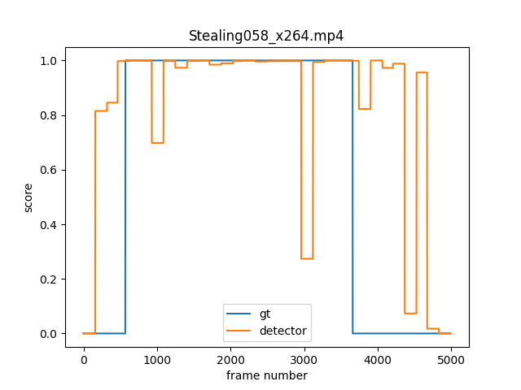

# Class-wise Anomaly Video Detection 

This repository is a re-implementation of "Real-world Anomaly Detection in Surveillance Videos" with pytorch. As a result of our re-implementation, we achieved a much higher AUC than the [original implementation](https://github.com/WaqasSultani/AnomalyDetectionCVPR2018).


## Initial Setting
1. git clone `this repository`
2. conda env create -f vidan.yaml && conda activate vidan
3. gdown https://drive.google.com/u/0/uc?id=18nlV4YjPM93o-SdnPQrvauMN_v-oizmZ && unzip UCF_and_Shanghai.zip -d /DATA

## Datasets
* Directory tree
 ```
    DATA/
        UCF-Crime/ 
            ../all_rgbs
                ../~.npy
            ../all_flows
                ../~.npy
        train_anomaly.txt
        train_normal.txt
        test_anomaly.txt
        test_normal.txt
        
```

## train-test script
```
python main.py
```

## Result

| METHOD | DATASET | AUC | 
|:--------:|:--------:|:--------:|
| Baseline (I3D two stream) | UCF-Crimes | 84.45 |

## Visualization

<table>
  <tr>
    <td></td> <td>
  <tr>
</table>

## Acknowledgment

This code is heavily borrowed from [Learning to Adapt to Unseen Abnormal Activities under Weak Supervision](https://github.com/junha-kim/Learning-to-Adapt-to-Unseen-Abnormal-Activities) and [AnomalyDetectionCVPR2018](https://github.com/WaqasSultani/AnomalyDetectionCVPR2018).

